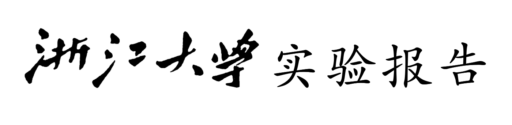

<font face = "楷体">
<font size = 2>


<center>
戴毅阳（3200104915）
</center>

<br>
课程名称：<u>图像信息处理</u>&emsp;指导老师：宋明黎

实验名称：<u>图像的几何变换</u>

### 一、实验目的和要求
1. 目的：
   
   学习图像的五种几何变换

2. 要求：
   
   （1）mirror
   
   （2）translation

   （3）shear

   （4）scale

   （5）rotation

### 二、实验内容和原理

1.mirror（镜像）
    
即将图像关于垂直轴或者水平轴翻转180度，此处讨论左右翻转（以垂直轴翻转）
$$
\begin{bmatrix}
x'\\
y'\\
1
\end{bmatrix}
=
\begin{bmatrix}
s_x&0&0\\
0&s_y&1\\
0&0&1
\end{bmatrix}
\begin{bmatrix}
x\\
y\\
1
\end{bmatrix}
$$
当$s_x=1,s_y=-1$，关于x轴翻转

当$s_x=-1,s_y=1$，关于y轴翻转

2.translation（平移）

即水平上下移动图像
$$\begin{bmatrix}
x'\\
y'\\
1
\end{bmatrix}
=
\begin{bmatrix}
1&0&x_0\\
0&1&y_0\\
0&0&1
\end{bmatrix}
\begin{bmatrix}
x\\
y\\
1
\end{bmatrix}
$$

3.shear（剪切）
此处主要讨论剪切y轴，

x轴：
$$\begin{cases}
a(x,y) = x+d_xy	\\
b(x,y) = y
\end{cases}$$
y轴:
$$\begin{cases}
a(x,y) = x	\\
b(x,y) = y+d_yx
\end{cases}$$


4.scale（缩放）
$$\begin{bmatrix}
x'\\
y'\\
1
\end{bmatrix}
=
\begin{bmatrix}
c&0&0\\
0&d&0\\
0&0&1
\end{bmatrix}
\begin{bmatrix}
x\\
y\\
1
\end{bmatrix}
$$
$c\in(0,1)$，图像缩小

$c\in(1,+ \infty)$，图像放大
对于d而言同理

5.rotation（旋转）
$$\begin{bmatrix}
x'\\
y'\\
1
\end{bmatrix}
=
\begin{bmatrix}
\cos\theta&-\sin\theta&0\\
\sin\theta&\cos\theta&0\\
0&0&1
\end{bmatrix}
\begin{bmatrix}
x\\
y\\
1
\end{bmatrix}
$$
### 三、实验步骤及分析
1.mirror（镜像）
    
即将图像关于垂直轴或者水平轴翻转180度，此处讨论左右翻转（以垂直轴翻转）
```C++
void mirror(RGB* origin)
{
	int size = bmpInfo.biSizeImage/3;
	int height = bmpInfo.biHeight;
	int width = bmpInfo.biWidth;
	width = (width%4)?(width/4+1)*4:width;

	RGB *res = new RGB[size];
	memset(res, 0, sizeof(RGB)*size);
	for(int i=0; i<height; i++){
		for(int j=0; j<width; j++) res[i*width+j] = origin[(i+1)*width-1-j];	
	}
    string name = "mirror";
    write(name, res, bmpInfo.biSizeImage/3, false);

	delete[] res;
}
```
此功能实现较为简单，处理过程与逆转数组操作类似，交换数组arr\[i\]与arr\[n-1-i\]即可

2.translation（平移）

即水平上下移动图像
```C++
void translation(RGB *origin, int dx, int dy)
{
	int size = bmpInfo.biSizeImage/3;
	// make the deltaX can be divided by 4 perfectly
	int deltaX = (dx%4)?(dx/4*4):dx;
	int deltaY = dy;
	int height = bmpInfo.biHeight;
	int width = bmpInfo.biWidth;
	width = (width%4)?(width/4+1)*4:width;

	int newHeight = height + deltaY;
	int newWidth = width + deltaX;
	int newSize = newHeight * newWidth;
	RGB *res = new RGB[newSize];
	// set the whole new picture white
	for(int i=0; i<newSize; i++) res[i].B = res[i].G = res[i].R = 255;
	
	for(int i=0; i<newHeight; i++){
		for(int j=0; j<newWidth; j++)
			if(i>=deltaY && j>=deltaX) res[i*newWidth+j] = origin[(i-deltaY)*width+(j-deltaX)];
	}
	newFile = bmpFile;
	newInfo = bmpInfo;
	// new size should be updated
	newFile.bfSize += (newSize*3-size*3);
	newInfo.biHeight = newHeight;
	newInfo.biWidth = newWidth;
	newInfo.biSizeImage = newSize*3;
    string name = "translation";
    write(name, res, newSize, true);

	delete[] res;
}
```
此过程也较为简单，只需注意需要将图片宽度调整为4的倍数；在扩展画布的同时，移动图片至指定位置
3.shear（剪切）
此处主要讨论剪切y轴，
```C++
void shear(RGB *origin, double angle)
{
	int size = bmpInfo.biSizeImage/3;
	int height = bmpInfo.biHeight;
	int width = bmpInfo.biWidth;
	width = (width%4)?(width/4+1)*4:width;
	int newWidth = width;
	int newHeight = bmpInfo.biHeight + tan(angle)*width;
	int newSize = newWidth * newHeight;
	RGB *res = new RGB[newSize];
	for(int i=0; i<newSize; i++) res[i].B = res[i].G = res[i].R = 255;
	
	for(int i=0; i<height; i++){
		for(int j=0; j<width; j++){
			int newY = floor(i+tan(angle)*j);
			res[newY*newWidth+j] = origin[i*width+j];
		}
	}
	newFile = bmpFile;
    newInfo = bmpInfo;
	newFile.bfSize = newFile.bfSize - size*3 + newSize*3;
	newInfo.biHeight = newHeight;
	newInfo.biWidth = newWidth;
	newInfo.biSizeImage = newSize*3;
	string name = "shear";
	write(name, res, newSize, true);
    
	delete[] res;
}
```


4.scale（缩放）
```C++
void scale(RGB *origin, double Xrate, double Yrate)
{
	int size = bmpInfo.biSizeImage/3;
	int height = bmpInfo.biHeight;
	int width = bmpInfo.biWidth;
	width = (width%4)?(width/4+1)*4:width;

	int newHeight = (int)(bmpInfo.biHeight * Yrate);
	int newWidth = (int)(bmpInfo.biWidth * Xrate);
	newWidth = (newWidth%4)?((newWidth/4+1)*4):newWidth;

	int newSize = newHeight * newWidth;
	RGB *res = new RGB[newSize];
	// set the whole new image as white background
	for(int i=0; i<newSize; i++) res[i].B = res[i].G = res[i].R = 255;
	
	for(int i=0; i<newHeight; i++){
		for(int j=0; j<newWidth; j++){
			int newX = (int)(j*1.0/Xrate);
			int newY = (int)(i*1.0/Yrate);
			res[i*newWidth+j] = origin[newY*width+newX];
		}
	}
    
	newFile = bmpFile;
	newInfo = bmpInfo;
	newFile.bfSize = newFile.bfSize-size*3+newSize*3;
	newInfo.biHeight = newHeight;
	newInfo.biWidth = newWidth;
	newInfo.biSizeImage = newSize*3;
	string name = "scale";
	write(name, res, newSize, true);

	delete[] res;
}
```
5.rotation（旋转）
```C++
Point rotate(Point p, double theta)
{
	int height = bmpInfo.biHeight;
	int width = bmpInfo.biWidth;
	width = (width%4)?(width/4+1)*4:width;
	int cx = width/2;
	int cy = height/2;
	p.x = p.x - cx;
	p.y = p.y - cy;
	double newX = p.x * cos(theta) - p.y * sin(theta) + cx;   
    double newY = p.x * sin(theta) + p.y * cos(theta) + cy;
    Point res = {newX, newY};
    return res;
}

// find the boundary of new image after rotation 
// -> range of x and y axis
void FindBoundary(int &x, int &y, double theta)
{
	double newX[4], newY[4];
	double minX = INF, minY = INF, maxX = 0, maxY = 0;
	int height = bmpInfo.biHeight;
	int width = bmpInfo.biWidth;
	width = (width%4)?(width/4+1)*4:width;
	Point p[4] = {{0, 0}, {width, 0}, {width, height}, {0, height}};
	for(int i=0; i<4; i++){
        Point ans = rotate(p[i], theta);
        newX[i] = ans.x;
        newY[i] = ans.y;
	}
 
	sort(newX, newX+4);
	sort(newY, newY+4);
	x = (int)(newX[3] - newX[0]);
	y = (int)(newY[3] - newY[0]);
	if(x % 4) x = (x/4+1)*4;
}
void rotation(RGB* origin, double theta)
{
	int size = bmpInfo.biSizeImage/3;
	int newHeight;
	int newWidth;
	FindBoundary(newWidth, newHeight, theta);
	int newSize = newHeight * newWidth;
	RGB *res = new RGB[newSize];
	bool *colored = new bool[newSize];
	int *leftBoundary = new int[newHeight];
	int *rightBoundary = new int[newHeight];
 
	for(int i=0; i<newSize; i++) res[i].B = res[i].G = res[i].R = 255;
	for(int i=0; i<newHeight; i++) leftBoundary[i] = INF;
	memset(rightBoundary, 0, sizeof(int)*newHeight);

	int height = bmpInfo.biHeight;
	int width = bmpInfo.biWidth;
	width = (width%4)?(width/4+1)*4:width;
	for(int i=0; i<newSize; i++) colored[i] = true;
	for(int i=0; i < height; i++){
		for(int j=0; j<width; j++){
			Point temp = {j, i}, ans;
            ans = rotate(temp, theta);
            int nx = (int)ans.x + (newWidth-width)/2;
			int ny = (int)ans.y + (newHeight-height)/2;
			res[ny*newWidth+nx] = origin[i*width+j];
			colored[ny*newWidth+nx] = false;
			leftBoundary[ny] = min(nx, leftBoundary[ny]);
			rightBoundary[ny] = max(nx, rightBoundary[ny]);
		}
	}
	// 插值
	for(int i=0; i<newHeight; i++){
		for(int j=0; j<newWidth; j++){
			if(j>=leftBoundary[i] && j<=rightBoundary[i]){
				if(colored[i*newWidth+j]){
					int k = j;
					while(k<newWidth && colored[i*newWidth+k]) k++;
					res[i*newWidth+j] = res[i*newWidth+k];
					colored[i*newWidth+j] = false;
				}
			}
		}
	}

	newFile = bmpFile;
	newInfo = bmpInfo;
	newFile.bfSize = newFile.bfSize-size*3+newSize*3;
	newInfo.biHeight = newHeight;
	newInfo.biWidth = newWidth;
	newInfo.biSizeImage = newSize*3;
	string name = "rotation";
	write(name, res, newSize, true);
	delete[] res;
	delete[] colored;
}
```
&emsp;&emsp;此操作是五个操作中最难实现的一个，此处先声明了一个rotate函数用于计算旋转后的坐标值。返回给函数FindBoundary来确认旋转后的图片边界，以此确定新画布的大小。需要注意的是，由于旋转后的坐标并非为整数，因此在图像更改完后，需要对于图像中本该有像素点却没有的地方加入数据，则需要进行插值，此处选取离需插值点最近的地方的值插入。
### 四、运行环境及方法

1. 编译器： clang++
2. 编辑器： vscode
3. 操作系统：macOS
4. 运行方法：已写makefile
```bash
make
make run
...(输入文件名即可)
make clean
```

### 五、成果展示
此处给出两幅图的代码运行后的结果：
1. 图片:


（1）mirror:


（2）translation:

（3）scale:

（4）shear:

（5）rotation:

### 六、心得体会

通过这次的实验，我对于图像的各种几何操作有了更加深刻的认识。但是，我依旧有一个疑惑无法消除：如何更好地进行插值以完美几何变形后的图像