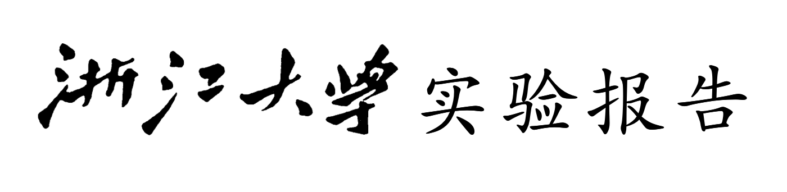
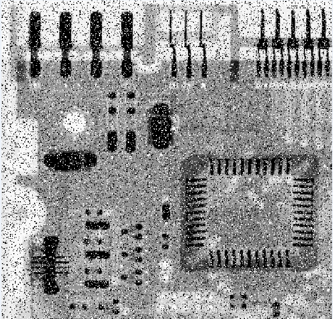
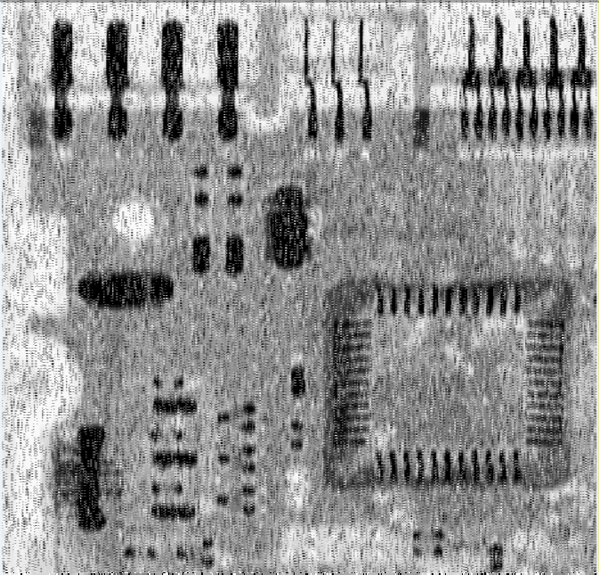
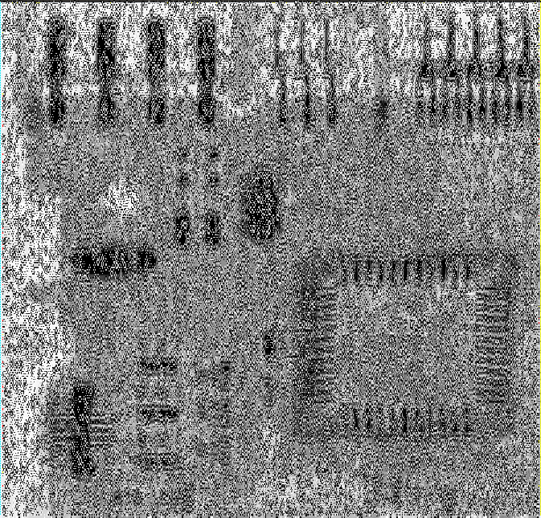
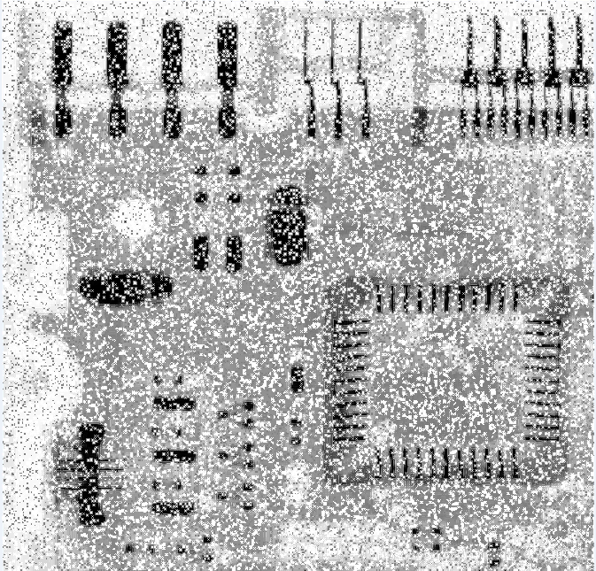

<font face = "楷体">
<font size = 2>


<center>
戴毅阳（3200104915）
</center>

<br>
课程名称：<u>图像信息处理</u>&emsp;指导老师：宋明黎

实验名称：<u>图像的均值滤波和拉普拉斯增强</u>

### 一、实验目的和要求
1. 目的：
   
   学习图像的均值滤波操作以及拉普拉斯增强

2. 要求：
   
   （1）均值滤波
   
   （2）拉普拉斯算子与拉普拉斯方法增强图像(Laplace Enhancement)

### 二、实验内容和原理

1.均值滤波
		滤波是消除图像中的噪声成分、使其平滑化的图像操作。此处着重介绍均值滤波，依次取图片中一个3x3的正方形像素块，进行如下操作：
$$
g(x,y) = \frac{1}{M}\Sigma_{(x,y)\in S}f(x,y)
$$
其中M为9(即$3^2$)，S即为遍历全部图像时每次所取的3x3正方形。

2.拉普拉斯算子

​		拉普拉斯算子为二阶微分线性算子，与一阶微分相比，二阶微分的边缘定位性更强从而使得锐化的效果更好。拉普拉斯算子定义如下：
$$
\nabla^2f=\frac{\partial^2f}{\partial x^2}+\frac{\partial^2f}{\partial y^2}
$$
同时又有由二阶微分的定义：
$$
\frac{\partial^2f}{\partial x^2}=f(x+1,y)+f(x-1,y)-2f(x,y)
$$

$$
\frac{\partial^2f}{\partial y^2}=f(x,y+1)+f(x,y-1)-2f(x,y)
$$

最终得到如下表达式：
$$
\nabla^2f=\frac{\partial^2f}{\partial x^2}+\frac{\partial^2f}{\partial y^2}=f(x+1,y)+f(x-1,y)+f(x,y+1)+f(x,y-1)-4f(x,y)
$$
这就表明在图像处理中拉普拉斯算子处理的结果为某个点的上下左右四个点的灰度值减去四倍该点原本的值。

最后得到拉普拉斯锐化(**Laplace Enhancement**)的公式为：
$$
g(x,y)=f(x,y)+c(\nabla^2f(x,y))
$$
其中$g$是输出的图像结果，$f$是输入的图像，$c$为某个特定常数。$\nabla^2f(x,y)$是经过拉普拉斯算子处理后得到的细节上的改变，而根据$c$的调整，可以调整输出图像中细节调整的多少和细节。

### 三、实验步骤及分析
1.均值滤波
		以周围8个点加上本身共9个点取平均值代替本点原来的值，本身代码操作没有太大难度，重要的是在读取bmp数据时，在每一行的数据如果不能被4整除的情况能否正确处理

```C++
        int width = bmpInfo.biWidth, height = bmpInfo.biHeight;
        width = (width*bmpInfo.biBitCount/8+3)/4*4;
        for(int i=0; i<height; i++){
            for(int j=0; j<width; j++){
                if((i==0||i==height-1) || (j==0||j==width-1)) res[i*width+j] = bmpdata[i*width+j];
                else{
                    res[i*width+j].B = (bmpdata[i*width+j+1].B+bmpdata[i*width+j].B+bmpdata[i*width+j+1].B
                    +bmpdata[(i-1)*width+j+1].B+bmpdata[(i-1)*width+j].B+bmpdata[(i-1)*width+j+1].B
                    +bmpdata[(i+1)*width+j+1].B+bmpdata[(i+1)*width+j].B+bmpdata[(i+1)*width+j+1].B) / 9;

                    res[i*width+j].R = (bmpdata[i*width+j+1].R+bmpdata[i*width+j].R+bmpdata[i*width+j+1].R
                    +bmpdata[(i-1)*width+j+1].R+bmpdata[(i-1)*width+j].R+bmpdata[(i-1)*width+j+1].R
                    +bmpdata[(i+1)*width+j+1].R+bmpdata[(i+1)*width+j].R+bmpdata[(i+1)*width+j+1].R) / 9;

                    res[i*width+j].G = (bmpdata[i*width+j+1].G+bmpdata[i*width+j].G+bmpdata[i*width+j+1].G
                    +bmpdata[(i-1)*width+j+1].G+bmpdata[(i-1)*width+j].G+bmpdata[(i-1)*width+j+1].G
                    +bmpdata[(i+1)*width+j+1].G+bmpdata[(i+1)*width+j].G+bmpdata[(i+1)*width+j+1].G) / 9;
                    res[i*width+j].B = overflow(res[i*width+j].B);
                    res[i*width+j].G = overflow(res[i*width+j].G);
                    res[i*width+j].R = overflow(res[i*width+j].R);
                }
            }
        }
```
其中bmpdata为读取出的bmp图像的数据，而res则是存储返回的处理后的图像数据

2.拉普拉斯图像增强变换

```C++
        int w[3];
        double c;
        cout << "Please enter the coefficient of Laplace transform: ";
        cin >> c;
        for(int i=0; i<height; i++){
            for(int j=0; j<width; j++){
                if((i==0||i==height-1) || (j==0||j==width-1)) res[i*width+j] = bmpdata[i*width+j];
                else{
                    w[0] = bmpdata[(i-1)*width+j].B+bmpdata[(i+1)*width+j].B
                    +bmpdata[i*width+j+1].B+bmpdata[i*width+j-1].B-4*bmpdata[i*width+j].B;
                    w[1] = bmpdata[(i-1)*width+j].G+bmpdata[(i+1)*width+j].G
                    +bmpdata[i*width+j+1].G+bmpdata[i*width+j-1].G-4*bmpdata[i*width+j].G;
                    w[2] = bmpdata[(i-1)*width+j].R+bmpdata[(i+1)*width+j].R
                    +bmpdata[i*width+j+1].R+bmpdata[i*width+j-1].R-4*bmpdata[i*width+j].R;
                    for(int i=0; i<3; i++){
                        if(w[i] > 0) w[i] = overflow(abs(w[i]));
                    }
                    res[i*width+j].B = bmpdata[i*width+j].B + c*w[0];

                    res[i*width+j].G = bmpdata[i*width+j].G + c*w[1];

                    res[i*width+j].R = bmpdata[i*width+j].R + c*w[2];
                }
            }
        }
```
如第二节所讲的原理对于每个图片中的像素点进行处理

### 四、运行环境及方法

1. 编译器： clang++
2. 编辑器： vscode
3. 操作系统：macOS
4. 运行方法：在命令行运行一下命令
```bash
clang++ main.cpp bmp.cpp -o result
./result
```

### 五、成果展示
此处给出两幅图的代码运行后的结果：
1. 图片:

   

（1）均值滤波：



（2）拉普拉斯图像增强：


此情况为$c=0.5$



此时$c=0.8$，但效果与$c=0.5$时比较，锐化效果是前者更佳

笔者也尝试使用python-opencv进行拉普拉斯变换，Python代码如下：

```Python
import cv2
import numpy as np

img = cv2.imread(r'./1.bmp',1)
dstimg = cv2.Laplacian(img, -1, ksize=3)
# dstimg = cv2.convertScaleAbs(dstimg)
dstimg = img + abs(dstimg)*0.5
dstimg = cv2.convertScaleAbs(dstimg)
cv2.imwrite('1_Laplace_py.bmp', dstimg)
 
# cv2.waitKey(0)
```

上图的Python处理结果如下：



### 六、心得体会

通过这次的实验，我对于图像的增强的各种操作有了更加深刻的认识。也尝试使用了python来验证图片操作代码的正确行然而不知为何两种方式处理得到的结果在亮度上有着一定的差异，这还有待我去探索